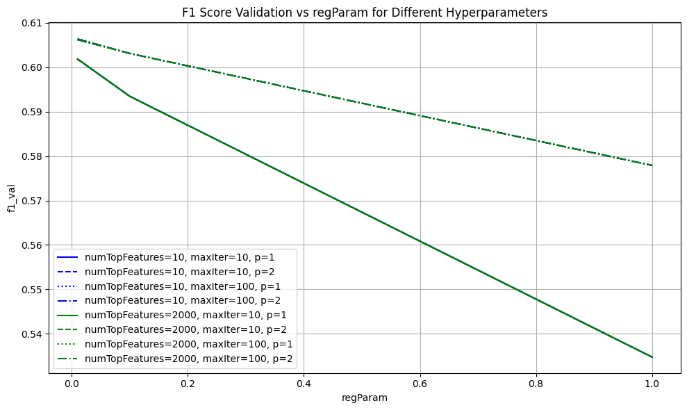
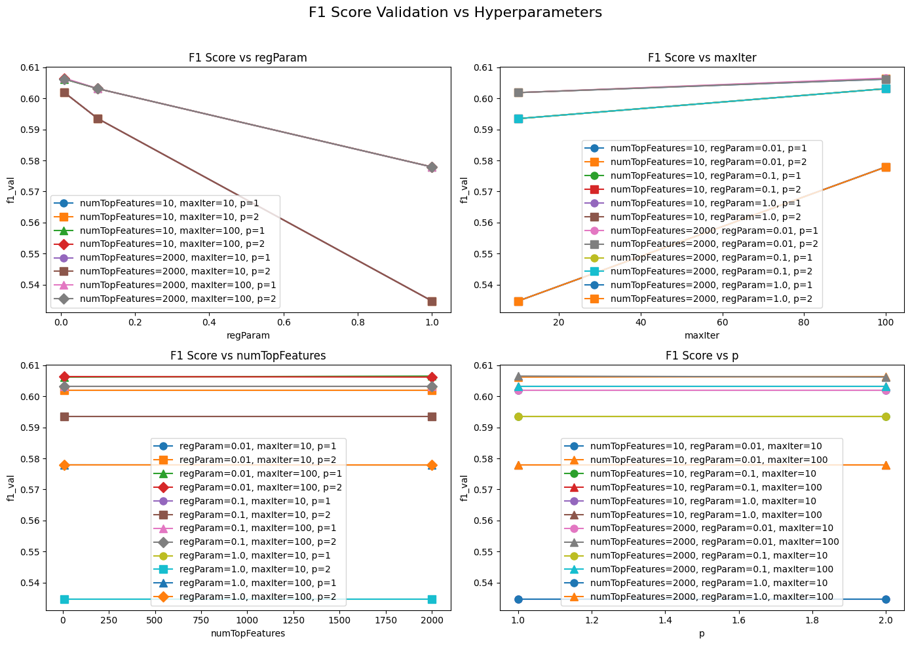

# usage

_docker_

-   run `docker-compose up` - see `./run.sh` for more details.

-   nice tutorial:

    -   https://www.youtube.com/watch?v=0H2miBK_gAk
    -   https://github.com/patrickloeber/python-docker-tutorial

-   image used:

    -   https://hub.docker.com/r/jupyter/pyspark-notebook
    -   https://github.com/jupyter/docker-stacks/blob/main/images/pyspark-notebook/Dockerfile
    -   https://jupyter-docker-stacks.readthedocs.io/en/latest/using/specifics.html

_local_

-   pyspark doesn't work with the latest 3.12 python and java 21 versions (as of may 2024) because of an incompatibility issue with `pyarrow`.

    see: https://stackoverflow.com/a/77318636/13045051

-   the jupyter team is using: python@3.11 and java@17.

    use a language runtime version manager like `asdf`.

    make sure that the workers use the same version of python as the driver. you can check this by running `pyspark` and reading the logs.

-   then install the following packages:

    ```bash
    brew install apache-spark

    python3 -m pip install pyspark 'pyspark[sql]' 'pyspark[ml]' 'pyspark[streaming]'
    ```
