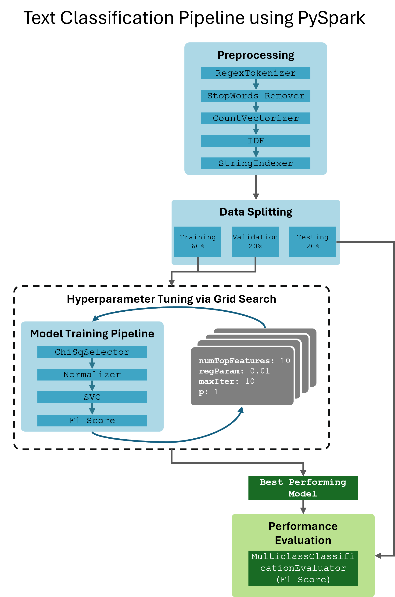
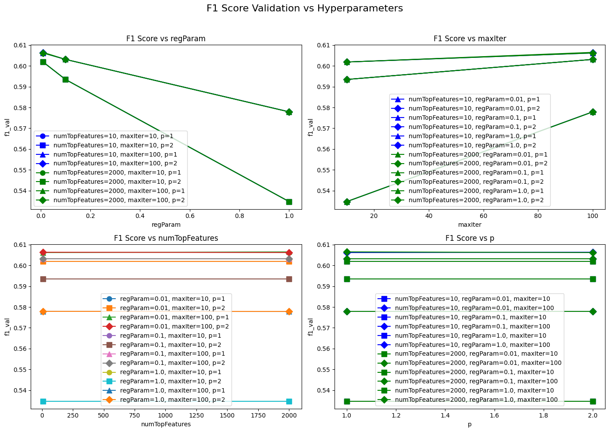

# 1. Introduction

This report delves into text processing and classification using Spark/PySpark, conducted on TU Wien's 12-node Hadoop Cluster. Building on Assignment 1, where an inital Map Reduce Job was created to calculate the Chi-Square Value for terms in the Amazon Review Dataset, in this assignment we re-implemented and extended the functionality using Spark/PySpark and finally trained a Support Vector Machine Model to predict the product category from a review's text.

First, we replicated the steps from Assignment 1, focusing on calculating chi-square values and identifying the top terms per category using Spark's RDDs and transformations. The output was saved to output_rdd.txt and compared with output.txt from Assignment 1 to observe and document any differences.

Next, we transformed the review texts into a classic vector space representation using TF-IDF weighted features, building a transformation pipeline with Spark’s DataFrame API. This included tokenization, case folding, stopword removal, TF-IDF calculation, and chi-square selection of the top 2000 terms.

Finally, we extended the pipeline to train a text classifier for predicting product categories from review texts. Using a Support Vector Machine (SVM) classifier, we implemented a strategy for multi-class classification by applying binary classifiers. We applied vector length normalization and conducted experiments to optimize the classifier's parameters, using a classical training, validation, and test set split approach. 

# 2. Problem Overview 

Classifying products based on their review texts is a significant challenge in natural language processing and machine learning. This task is essential for e-commerce platforms, enhancing user experience by organizing products effectively, improving search accuracy, and personalizing recommendations. Given the vast amount of unstructured text data in customer reviews, developing efficient and accurate classification models is crucial.

One primary challenge in product classification is the high dimensionality of review texts, which contain numerous unique words. This leads to high-dimensional feature spaces with many irrelevant features.

The chi-square statistic helps address these challenges by selecting the most relevant features for each category. By calculating the chi-square value for each word, we can identify terms strongly associated with specific categories, reducing the dimensionality of the feature space and retaining only the most informative words. This process improves classifier efficiency and accuracy by minimizing noise from irrelevant features and ensuring important terms from underrepresented categories are included.

Support Vector Machines (SVM) are well-suited for high-dimensional text classification. They handle large feature spaces effectively by finding the optimal hyperplane that maximizes class separation. SVMs are robust to overfitting due to their regularization capabilities and can model complex relationships through kernel functions. For multi-class problems, strategies like One-vs-One or One-vs-All extend SVMs' applicability, allowing them to classify products into multiple categories accurately.

# 3. Methodology and Approach 

In this chapter, we outline the methodology and approach used for text classification based on product reviews. We explore different stages of data processing and model training using PySpark, starting with the implementation of chi-square statistics for feature selection using RDDs and transitioning to Spark ML Pipelines for preprocessing and feature selection. Finally, we detail the incorporation of a Support Vector Machine (SVM) classifier to predict product categories.

## 3.1 RDDs

As in assignment 1 we are calculating the chi-square statistoic for each word in each category. In the preprocessing stage, we performed tokenization, case folding, and stopword removal. We defined a regular expression for tokenization and loaded the stopwords into a broadcast variable. Each review text was tokenized into terms, converted to lowercase, and stripped of stopwords. 

Then in the calculatiohn chi-square statistics for feature selection, we first computed various counts:
* Category Count: The number of reviews per category.
* Term Count: The number of occurrences of each term across all reviews.
* Term-Category Count: The number of occurrences of each term within each category.

These counts were then broadcasted to be accessible across all nodes. We used these counts to compute the chi-square statistic for each term-category pair, determining how strongly each term was associated with each category. The chi-square statistic in this context is calculated using again the formula from assignment 1:

$$
\chi^2_{tc} = \frac{N(AD-BC)^2}{(A+B)(A+C)(B+D)(C+D)}
$$
where: 

* A counts how many reviews in a particular category mention the term,
* B counts mentions of the term in reviews outside that category,
* C counts non-mentions of the term within the category,
* D tallies non-mentions outside the category,
* N is the total number of documents which can be omitted if we are just interested in the rankings.

We then selected the top 75 terms per category based on their chi-square values.

## 3.2 Datasets/DataFrames: Spark ML and Pipelines

Now we transform the implementation done via RDDs by using the PySpark DataFrames and the SparkML Pipelines for preprocessing and feature selection of the top 2000 features. The preprocessing pipeline consisted of several stages designed to clean and transform the text data into a format suitable for the SVM of part 3.

1. RegexTokenizer: Tokenized the `reviewText` into terms based on a specified regular expression.
2. StopWordsRemover: Removed the stopwords from the tokenized terms.
3. CountVectorizer: Converted the terms into raw feature vectors, where each feature represented the frequency of a term within the document.
4. IDF (Inverse Document Frequency): Applied IDF to the raw feature vectors to reduce the impact of frequently occurring terms, enhancing the significance of rare terms.
5. StringIndexer: Converted the categorical `category` column into numerical labels, necessary for the SVM model.
6. ChiSqSelector: Selected the top 2000 features based on chi-square statistics, reducing the dimensionality of the feature space and retaining the most informative terms.

The pipeline stages were defined and assembled into a single `Pipeline` object, which was then fitted to the dataset.

```python
stages = [
    RegexTokenizer(inputCol="reviewText", outputCol="rawTerms", pattern=regex),
    StopWordsRemover(inputCol="rawTerms", outputCol="terms", stopWords=stopwords),

    CountVectorizer(inputCol="terms", outputCol="rawFeatures"),
    IDF(inputCol="rawFeatures", outputCol="features"),

    StringIndexer(inputCol="category", outputCol="label"),
    ChiSqSelector(featuresCol="features", outputCol="selectedFeatures",
    labelCol="label", numTopFeatures=2000)]

pipeline = Pipeline(stages=stages)
```

After transforming the dataset with the fitted pipeline, we extracted the selected features. The `CountVectorizerModel` provided the vocabulary, while the `ChiSqSelector` provided the indices of the selected features. We used these indices to retrieve the corresponding terms from the vocabulary, representing the top features selected by the chi-square test.


## 3.3 Text Classification

In this section, we expanded upon the pipeline from Part 2 by incorporating a support vector machine (SVM) classifier to predict product categories based on review text. The preprocessing pipeline remained consistent with the previous part, but we divided the process into two distinct pipelines: one for preprocessing and another for model training. This approach ensures that the preprocessing steps are only performed once, even when experimenting with different hyperparameter configurations, thereby improving efficiency. To facilitate this, we placed the `ChiSqSelector()` stage in the model training pipeline rather than in the preprocessing pipeline.

Separating the preprocessing from model training and saving the preprocessed data to disk allows us to materialize the execution plan. Restarting the Spark session between these stages helps prevent data cached or persisted during one job from affecting another, ensuring that each job starts with a clean slate and avoiding unintended data carryover.

Prior to saving the preprocessed data, we split the dataset into training, validation, and test sets (60%, 20%, 20%). The training and validation sets are used for hyperparameter tuning, while the test set is reserved for final evaluation. To ensure reproducibility of the `randomSplit()` function in PySpark, we cache the DataFrame to memory and disk. Caching is crucial as it guarantees that the split is consistent across runs. Given the substantial size of our dataset, we opted against using K-Fold Cross-Validation due to its computational intensity, finding that validation on a separate set was sufficient.

We conducted a grid search over the following hyperparameter space:

* numTopFeatures: [10, 2000]
* regParam: [0.01, 0.1, 1]
* maxIter: [10, 100]
* p: [1, 2]

The performance of each configuration was evaluated on the validation set using the F1 metric. The best-performing model from this grid search was then applied to the test set for the final performance evaluation.

The general approach of the pipeline can be seen in Figure 1. 

```{r fig:Pipeline Ilustration, echo=FALSE, fig.cap="Text Classification Pipeline using PySpark", fig.align='center'}

```

# 4. Results 

## 4.1 RDDs

When comparing the implementation of the MapReduce job via MRJob and the calculation of chi-square values using Spark RDDs, it is evident that Spark via RDDs is significantly more developer-friendly in terms of development effort. The Spark RDD implementation abstracts many complexities, allowing for more straightforward and readable code.

Regarding the results, we observe slight differences in the decimal values of the chi-square statistic, which lead to variations in the ordering and list of terms per category. These discrepancies are likely due to differences in floating-point arithmetic precision between Python and Spark/Java, as well as differences in the order of execution between the two jobs. Despite these minor differences, the overall results are consistent and reliable.

## 4.2 Datasets/DataFrames: Spark ML and Pipelines

The implementation using Spark ML pipelines is even more user-friendly compared to the RDD approach. Spark ML's high-level abstractions and pipeline API simplify the process of building and managing machine learning workflows, making it an excellent choice for big data analysis. The results also seem to be inline with our expectations.

## 4.3 Text Classification

Using PySpark for text classification proved to be straightforward, and we achieved satisfactory results. From Figure 2, it is evident that some hyperparameters do not significantly affect the model's performance on the validation set. Specifically, the regularization parameter `regParam` has a strong influence on performance, with less regularization leading to better model performance. Additionally, the number of iterations (`maxIter`) positively influences the model performance. Conversely, the number of features used and the normalization in the $L^P$ space do not significantly affect the model's performance.

```{r fig:F1_Hyper2, echo=FALSE, fig.cap="F1 Score on the Validation Set across the Hyperparameter Configurations", fig.align='center'}

```

The best-performing model had the following hyperparameter configurations:

* Number of top features used in the model: 2000
* Regularization parameter 0.01
* Maximal number of iterations: 100
* p: 1

This model achieved a validation set performance of 0.606489 (F1 Score) and a test set performance of 0.606259.

Additionally, the mean runtime depending on the maximum number of iterations was as follows:

| maxIter | Runtime in s|
|---------|-------------|
| 10      | 75.500000   |
| 100     | 578.166667  |

It is important to note that although the identified hyperparameters yielded the best performance on the validation set, in a real-world application, we might also consider a model with the same hyperparameter configuration but using a lower number of features. The performance difference is minimal, yet reducing the number of features can enhance the model's interpretability and usability, making it easier to understand and implement.

All the performance metrics can be found in the appendix.

# 5. Conclusions

# Appendix


|   numTopFeatures |   regParam |   maxIter |   p |   f1_train |   f1_val |   runtime_training |   runtime_train_pred |   runtime_train_val |   runtime_train_eval |
|-----------------:|-----------:|----------:|----:|-----------:|---------:|-------------------:|---------------------:|--------------------:|---------------------:|
|               10 |       0.01 |        10 |   1 |   0.872742 | 0.60184  |                 90 |                    4 |                   3 |                   11 |
|               10 |       0.01 |        10 |   2 |   0.872742 | 0.60184  |                 72 |                    4 |                   3 |                   10 |
|               10 |       0.01 |       100 |   1 |   0.938119 | 0.606172 |                551 |                    3 |                   3 |                   11 |
|               10 |       0.01 |       100 |   2 |   0.938183 | 0.606335 |                562 |                    3 |                   3 |                   11 |
|               10 |       0.1  |        10 |   1 |   0.871112 | 0.593461 |                 74 |                    3 |                   3 |                   11 |
|               10 |       0.1  |        10 |   2 |   0.871112 | 0.593461 |                 77 |                    4 |                   3 |                   11 |
|               10 |       0.1  |       100 |   1 |   0.908307 | 0.6031   |                588 |                    3 |                   3 |                   12 |
|               10 |       0.1  |       100 |   2 |   0.908307 | 0.6031   |                585 |                    3 |                   3 |                   12 |
|               10 |       1    |        10 |   1 |   0.782206 | 0.534759 |                 73 |                    3 |                   3 |                   10 |
|               10 |       1    |        10 |   2 |   0.782206 | 0.534759 |                 76 |                    3 |                   3 |                   10 |
|               10 |       1    |       100 |   1 |   0.850733 | 0.577915 |                582 |                    3 |                   3 |                   10 |
|               10 |       1    |       100 |   2 |   0.850733 | 0.577915 |                584 |                    3 |                   3 |                   12 |
|             2000 |       0.01 |        10 |   1 |   0.872742 | 0.60184  |                 77 |                    3 |                   3 |                   11 |
|             2000 |       0.01 |        10 |   2 |   0.872742 | 0.60184  |                 73 |                    3 |                   3 |                   11 |
|             2000 |       0.01 |       100 |   1 |   0.938123 | 0.606489 |                583 |                    3 |                   3 |                   11 |
|             2000 |       0.01 |       100 |   2 |   0.938183 | 0.606181 |                581 |                    3 |                   3 |                   11 |
|             2000 |       0.1  |        10 |   1 |   0.871112 | 0.593461 |                 73 |                    3 |                   3 |                   10 |
|             2000 |       0.1  |        10 |   2 |   0.871112 | 0.593461 |                 73 |                    3 |                   3 |                    9 |
|             2000 |       0.1  |       100 |   1 |   0.908307 | 0.6031   |                585 |                    3 |                   3 |                   13 |
|             2000 |       0.1  |       100 |   2 |   0.908307 | 0.6031   |                588 |                    3 |                   3 |                   10 |
|             2000 |       1    |        10 |   1 |   0.782206 | 0.534759 |                 76 |                    3 |                   3 |                   12 |
|             2000 |       1    |        10 |   2 |   0.782206 | 0.534759 |                 72 |                    3 |                   3 |                   10 |
|             2000 |       1    |       100 |   1 |   0.85071  | 0.577888 |                582 |                    4 |                   4 |                   11 |
|             2000 |       1    |       100 |   2 |   0.85071  | 0.577888 |                567 |                    4 |                   3 |                   11

